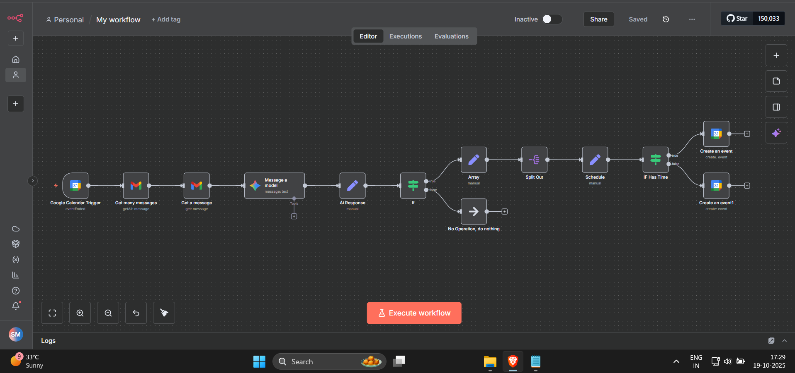
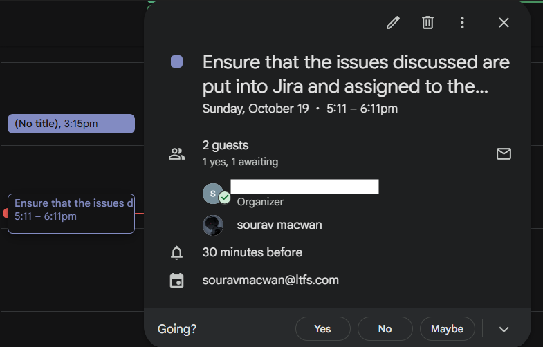

# Gmail to Google Calendar Task Automation with n8n + Google Gemini AI

This **n8n workflow** automates task management by fetching meeting notes from Gmail, extracting actionable tasks using **Google Gemini AI**, and scheduling them in **Google Calendar**. Tasks without a specified time are automatically scheduled 24 hours later.

---

## 📌 Features

* Triggered automatically when a Google Calendar event ends
* Filters Gmail for relevant meeting notes
* AI-powered task extraction for tasks mentioning you or requiring action
* Automatically assigns timings if none are provided
* Supports multiple tasks per email
* Fully automated workflow from email → AI → Calendar

---

## 🛠 Workflow Nodes & Description

| Node Name                | Type             | Description                                          |
| ------------------------ | ---------------- | ---------------------------------------------------- |
| Google Calendar Trigger  | Trigger          | Detects when a calendar event ends                   |
| Get many messages        | Gmail            | Queries Gmail for relevant meeting notes             |
| Get a message            | Gmail            | Retrieves full content of selected email             |
| Message a model          | Google Gemini AI | Extracts tasks from email content                    |
| AI Response              | Set              | Stores AI output in JSON                             |
| If                       | Conditional      | Checks if AI returned actionable tasks               |
| Array                    | Set / Split      | Splits multiple tasks into individual items          |
| Schedule                 | Set              | Extracts task summary and timing                     |
| IF Has Time              | Conditional      | Checks if a timing exists for the task               |
| Create an event          | Google Calendar  | Schedules tasks with provided timing                 |
| Create an event1         | Google Calendar  | Schedules tasks with default timing if none provided |
| No Operation, do nothing | NoOp             | Placeholder for “no task” condition                  |

---

## ⚙️ Setup Instructions

1. Install **n8n** (desktop or self-hosted).
2. Import this workflow JSON into n8n.
3. Configure credentials:

   * Gmail OAuth2
   * Google Calendar OAuth2
   * Google Gemini (PaLM) API
4. Replace email addresses in the workflow with your own.
5. Activate the workflow and monitor execution logs.

---

## 🚀 How it Works

1. Triggered automatically when a Google Calendar event ends.
2. Fetches recent Gmail meeting notes using filters.
3. Uses **Google Gemini AI** to extract actionable tasks mentioning you.
4. Splits tasks and assigns timings (either specified or default 24 hours later).
5. Schedules tasks in Google Calendar automatically.

---

## ✅ Advantages

* **No-code / Low-code** – Easy to set up without programming.
* **AI-powered** – Automatically detects actionable tasks from unstructured emails.
* **Customizable** – Filter emails, extract tasks, assign timings, and schedule events.
* **Open-source** – Fully extendable and modifiable for other workflows.

---

## ⚠️ Disadvantages / Considerations

* Learning curve for multi-step workflows with AI.
* Large volumes of emails can slow down execution.
* Debugging multi-node workflows can be challenging.
* Make sure AI prompts and emails do not include sensitive information when sharing.

---

## 📸 Images / Screenshots

* **Workflow Diagram** – `n8n_automation.png`

